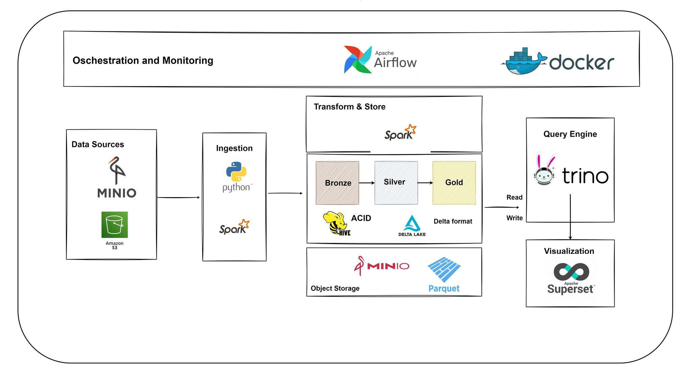

# Data Lakehouse Project

## Introduction

This project is building data lakehouse architecture storing data analytics books

Key components include:

- **MinIO** for distributed object storage.
- **Delta Lake** for ACID-compliant transactions.
- **Apache Spark** for distributed computing and analytics.
- **Trino** for fast SQL queries.
- **Hive Metastore** for a unified data catalog.
- **Apache Superset** for data visualization.

By using these components, organizations can quickly and efficiently access and analyze valuable data, empowering better data-driven decision-making.

## Description

**Warning**: This project is a work in progress and not yet ready for production use. Please use it at your own risk.

This platform integrates several specialized tools for data analytics, built upon the following components:

- [Apache Spark](https://spark.apache.org/): A unified analytics engine for big data processing, with modules for streaming, SQL, machine learning, and graph processing.
- [Delta Lake](https://delta.io/): An open-source storage layer that brings ACID transactions to Apache Spark and big data workloads.
- [Apache Airflow](https://airflow.apache.org/): A platform to programmatically author, schedule, and monitor workflows.
- [MinIO](https://min.io/): A high-performance, distributed object storage system, 100% open source under the Apache V2 license.
- [Trino](https://trino.io/): A distributed SQL query engine designed for fast analytic queries against data of any size.
- [Hive Metastore](https://cwiki.apache.org/confluence/display/Hive/Hive+Metastore): A central repository of Hive metadata, storing metadata for Hive tables and partitions.
- [Apache Superset](https://superset.apache.org/): A modern data exploration and visualization platform.

### System Architecture

The system architecture is illustrated in the following diagram:


This architecture leverages stable technologies to build a scalable, reliable, and user-friendly data lakehouse platform, supporting the storage, processing, and analysis of large datasets.

Despite using stable technologies, the platform is a work in progress. We are continuously improving it and adding new features. Any suggestions or feedback to help us enhance the platform are welcome.

### Data Pipeline


### Data Visualization


### Query Execution


## Getting Started

### Installation

1. **Clone the repository**:

   ```bash
   git clone https://github.com/quoc-duc/lakehouse-tuyensinh
   cd lakehouse-tuyensinh
   ```

2. **Build and run the services**:

   ```bash
   make all
   ```
   ```bash
   docker compose down -v 
   ```
3. **Access the services**:
   - **Superset**: [http://localhost:8088](http://localhost:8088)
   - **Trino**: [http://localhost:8443](http://localhost:8443)
   - **MinIO**: [http://localhost:9000](http://localhost:9000)
   - **Airflow**: [http://localhost:8080](http://localhost:8080)

## Usage

- **Apache Spark**: Use Spark for big data processing and analytics.
- **Delta Lake**: Ensure ACID transactions for your data.
- **Apache Airflow**: Schedule and monitor data workflows.
- **MinIO**: Store and retrieve data objects.
- **Trino**: Execute fast SQL queries on your data.
- **Hive Metastore**: Manage your metadata.
- **Apache Superset**: Visualize your data.
